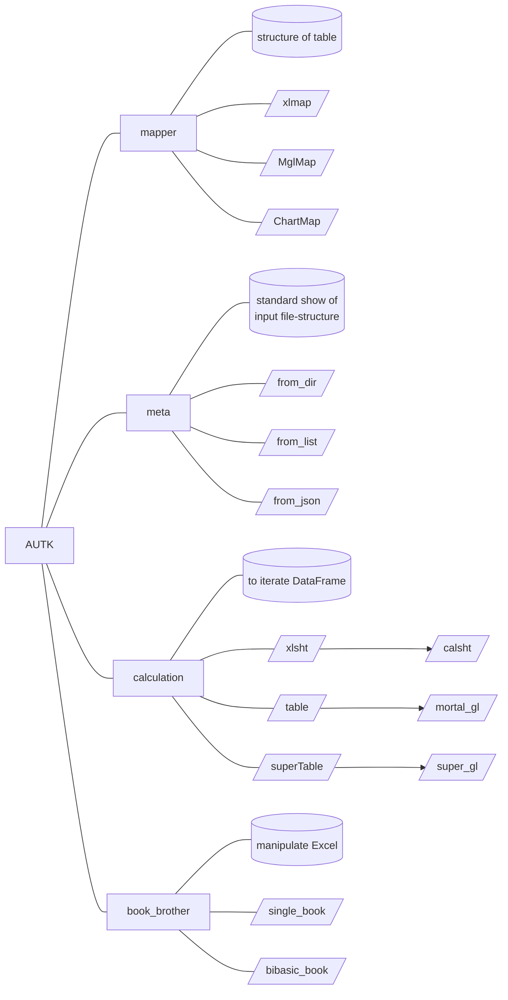
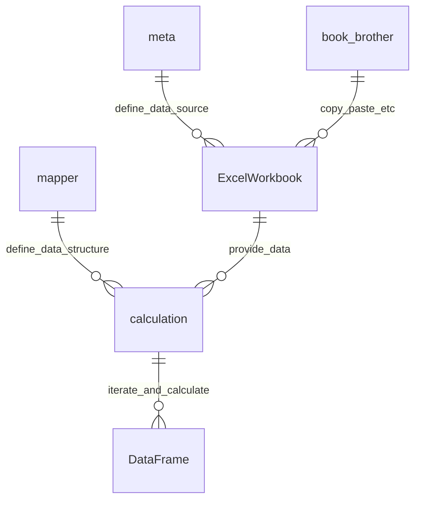
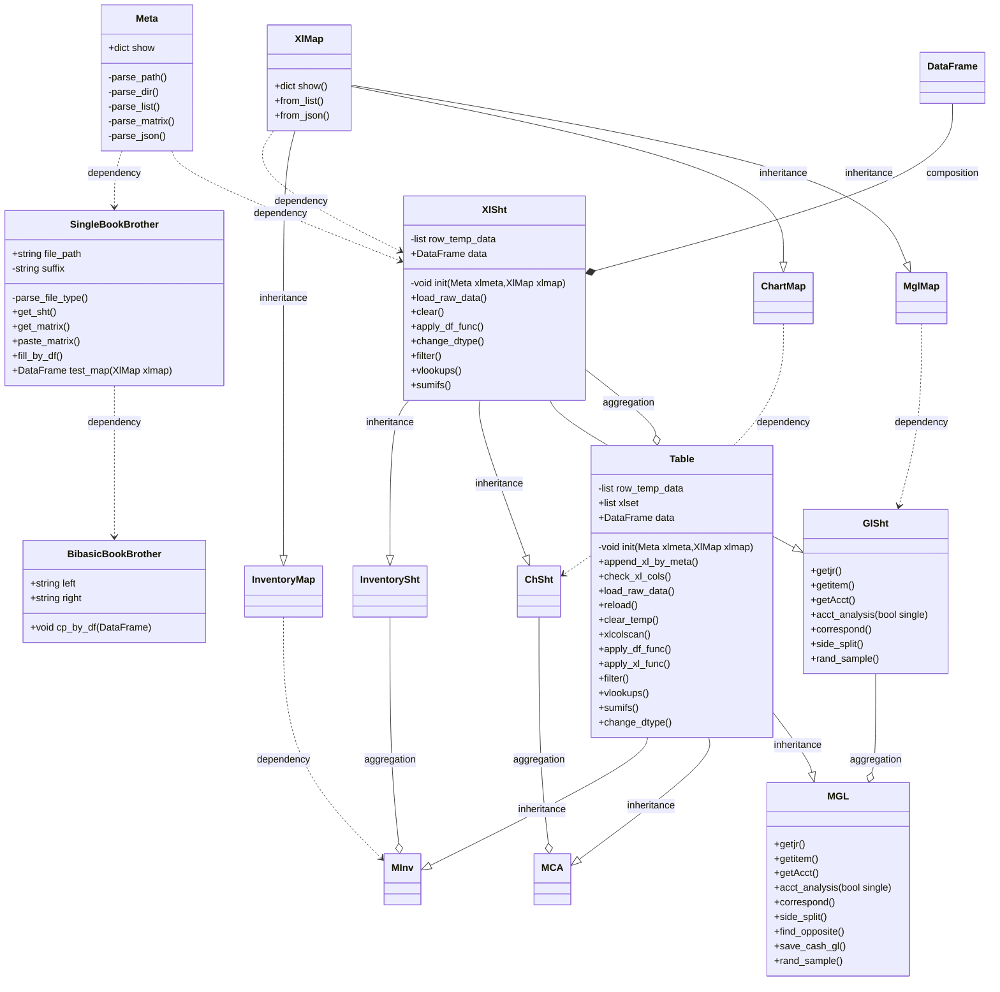

# autkrestructure
Restructure for repository AUTK( version 4; python;).
## Looking back
version|description
---|---
1.0|Simply load `xlsx` book and analysis.
2.0|manage worksheet by `mgl`.
3.0|structure of `mgl` is determined by `xlmap`.
4.0|four key modules:meta,map,table,bookbrother

## Core module structure

## Module-relationship

## Class design

